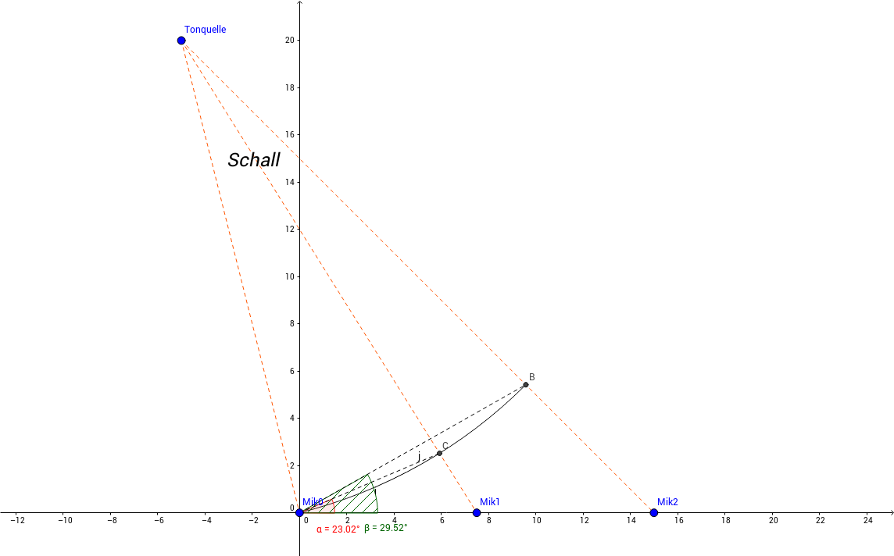
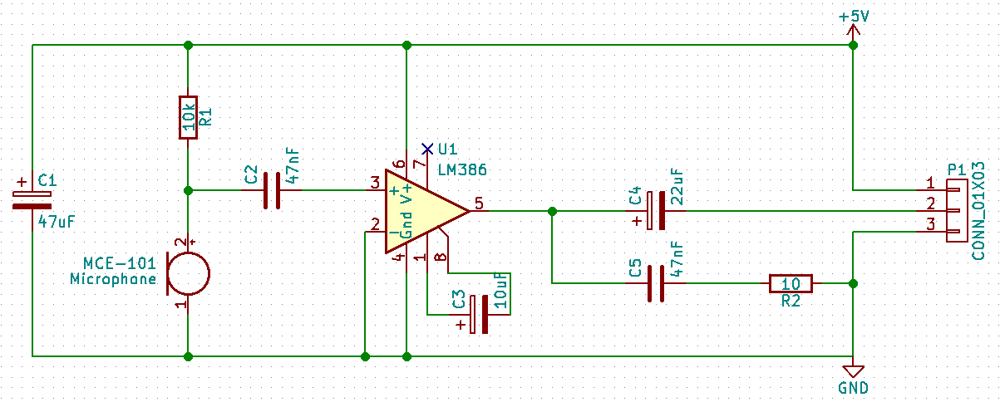
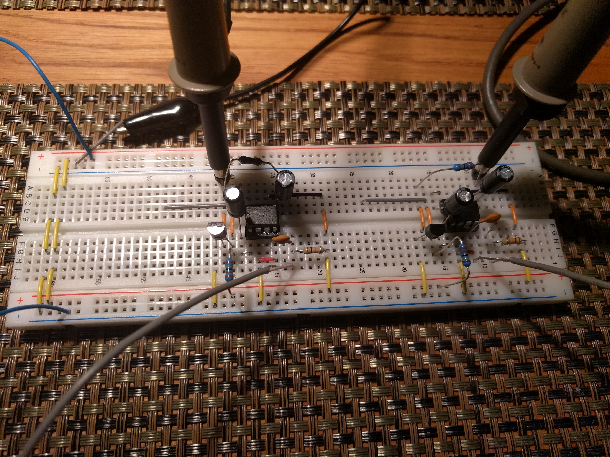
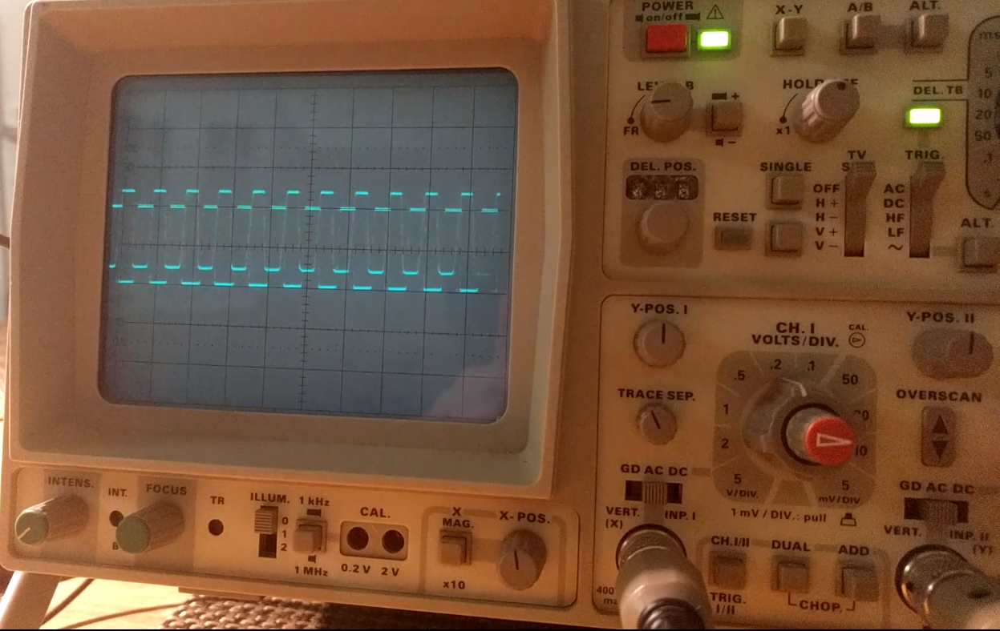
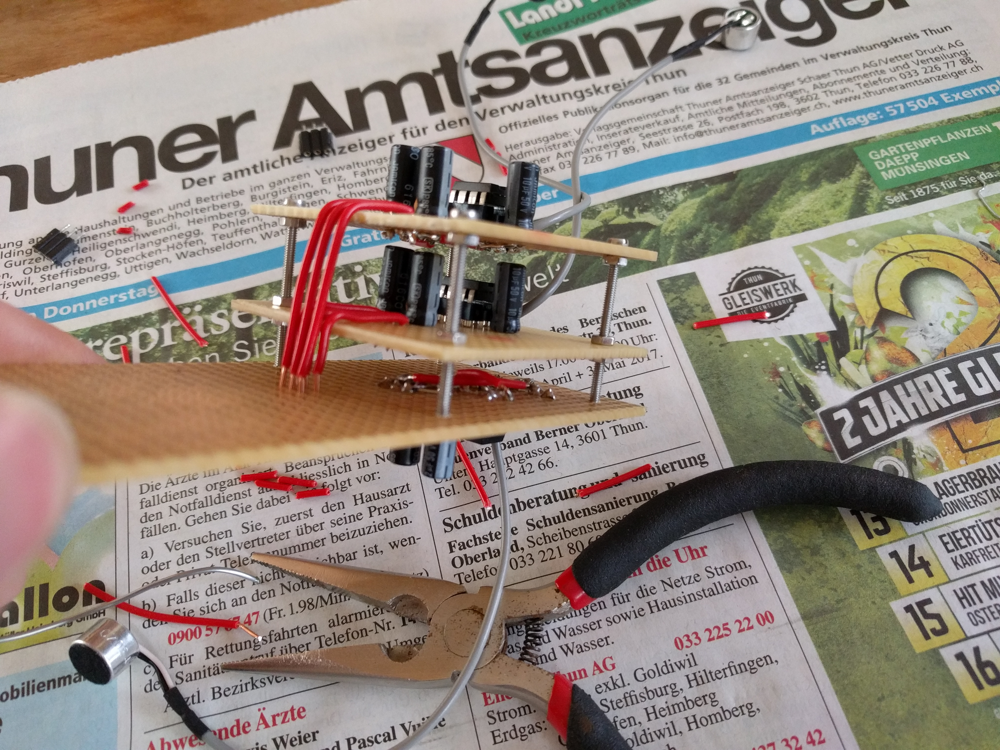
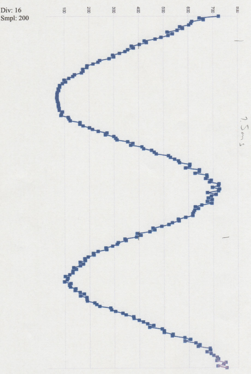

# BFH Physik 2 Individualprojekt
## Ziel
Eine Tonquelle im 2D Raum lokalisieren können.

## Methode
Drei Mikrofone in einer Reihe erkennen nacheinander den Amplitudenanstieg und messen die Zeitdifferenz zwischen ihnen. Die beiden Winkel von den letzten erreichten Mikrofonen zum ersten Mikrofon werden als Mittelwert gerechnet, um die Präzision zu erhöhen.

## Realisierung
### Hardware
Ich entschied mich Mikrofonkapseln des Typs MCE-101 zu kaufen und die Verstärkerschaltung selber mithilfe eines Verstärker ICs zu realisieren.
Aufgrund der mir passenden Merkmale (Spannung, Verstärkung) sowie der Erhältlichkeit im DIP Format, wählte ich den LM386 IC von Texas Instruments.
Die Grundschaltung ist einfach aufzubauen und erfordert nicht allzu viele weitere Bauteile.
Somit zeichnete ich das folgende Schema, welches ich in dreifacher Ausführung auf einer Lochplatine mit den Bauelementen lötete.

Hinweis: Das Schema ist als KiCAD Projekt im Verzeichnis `soundtracker/` hinterlegt.

Nach einem Check mit dem Oszilloskop nahm ich alle drei Verstärkerschaltungen und baute diese wie einen Turm aufeinander. Die Mikrofone befestigte ich in einer Holzleiste.

Man beachte die Amplitudenverschiebung.

Nach der Fertigstellung und der Verdrahtung mit dem Arduino sieht der Aufbau wie folgt aus:

### Software
Die Arduino Bibliotheken stellen m.E. eine Abstraktionsschicht mit unbekannten Nebeneffekten da,
welche ich insbesondere für solche Zeitmessungen vermeiden will. Deshalb entschied ich mich die Software in C mit Unterstützung der Atmel avr-libc zu entwickeln.

#### Entwicklungsumgebung
* Compiler: `avr-gcc (GCC) 7.1.0`
* Linker: `GNU ld (GNU Binutils) 2.28`
* Binutils: `GNU Binutils 2.28`
* Programmer: `avrdude version 6.3`

#### Prescaler
Da der Analog-Digital-Converter des ATmega328p eine maximale Auflösung von 10 Bit bei einer Timerfrequenz zwischen 50kHz und 200kHz hat und ich diese aufgrund einer schnelleren Abtastrate überziehen will, liess ich 200 Sampels mit einer Clock Frequency von 1MHz (Prescaler auf /16) aufnehmen und plottete es aus:

Da die Genauigkeit dieser Kurve für meinen Einsatzzweck stimmt, ging ich weiter an die Implementierung.

#### Zeitmessung
In einem Loop prüfe ich, ob der analoge Wert irgendeines Mikrofones auf über 600 ansteigt (`BREAKOUT_LEVEL`). Falls dies zutrifft setze ich den 16-Bit Timer auf 0 und fahre mit dem Loop fort, wobei ich beim Erreichen des breakout levels für die anderen beiden Mikrofone den Timerwert in einer Variable speichere. Erreichten alle Mikrofone mal diesen Wert, werte ich das Ergebnis aus und warte zwei Sekunden, bis die Routine von vorne beginnt.

#### Positionsbestimmung
Für die Positionsbestimmung bestimme ich mit hilfe des Tangens und einer Zeit-Zu-Distanz Funktion den Winkel vom zuletzt erreichten Mikrofon zum ersten (150mm Hypotenuse), sowie vom dazwischenliegenden zum ersten (75mm Hypotenuse). Den Mittelwert betrachte ich als Ergebnis und schicke es über UART im Gradmass weiter.

#### Serielle Kommunikation
Als Schnittstelle zwischen dem ATmega und weiterer Peripherie wählte ich UART, da es aufgrund der Arduino Architektur über USB als serielle Schnittstelle (`USB ACM device`) erkannt wird. Die Schnittstelle wird nur sendend mit 9600 Baud verwendet, wobei zum Senden auf die `stdio` von avr-libc zurückgegriffen wird.

# Literatur
- LM-386 Verstärker [www.ti.com](http://www.ti.com/lit/ds/symlink/lm386.pdf)
- AVR libC [www.atmel.com](http://www.atmel.com/webdoc/avrlibcreferencemanual/group__avr__sfr_1gaaf6857fa882da35f8685e2001e5c3bbe.html)
- ATmega328p [www.atmel.com](http://www.atmel.com/images/Atmel-8271-8-bit-AVR-Microcontroller-ATmega48A-48PA-88A-88PA-168A-168PA-328-328P_datasheet_Complete.pdf)

# Hinweise
Der Quellcode inkl. die Dokumentation befindet sich auf [github.com/djboris9/bfh_physik2](https://github.com/djboris9/bfh_physik2)

PDF generiert mit `pandoc  README.md -o readme.pdf -V geometry:margin=1in`
